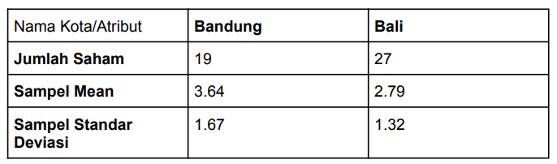

## Nama NRP
| Nama                    | NRP        |
|-------------------------|------------|
| Hilmi Zharfan Rachmadi  | 5025201268 |

## Soal 1
Seorang peneliti melakukan penelitian mengenai pengaruh aktivitas 𝐴 terhadap
kadar saturasi oksigen pada manusia. Peneliti tersebut mengambil sampel
sebanyak 9 responden. Pertama, sebelum melakukan aktivitas 𝐴, peneliti mencatat
kadar saturasi oksigen dari 9 responden tersebut. Kemudian, 9 responden tersebut
diminta melakukan aktivitas 𝐴. Setelah 15 menit, peneliti tersebut mencatat kembali
kadar saturasi oksigen dari 9 responden tersebut. Berikut data dari 9 responden
mengenai kadar saturasi oksigen sebelum dan sesudah melakukan aktivitas 𝐴

 

Berdasarkan data pada tabel diatas, diketahui kadar saturasi oksigen dari
responden ke-3 ketika belum melakukan aktivitas 𝐴 sebanyak 67, dan setelah
melakukan aktivitas 𝐴 sebanyak 70.

* a. Carilah Standar Deviasi dari data selisih pasangan pengamatan tabel diatas
``` R
# a.
oxy = data.frame(Responden = c(1,2,3,4,5,6,7,8,9), 
                 X=c(78,75,67,77,70,72,78,74,77),
                 Y=c(100,95,70,90,90,90,89,90,100))
diff <- oxy$Y-oxy$X
oxy$diff <- diff
oxy
sd(oxy$diff)
```


* b. Carilah nilai t (p-value)
``` R
# b.
install.packages("tidyverse")
install.packages("ggpubr")
install.packages("rstatix")

library("tidyverse")
library("ggpubr")
library("rstatix")

oxy.long <- oxy %>%
  gather(key = "group", value = "saturation", X, Y)
head(oxy.long, 3)

oxy.long %>%
  group_by(group) %>%
  get_summary_stats(saturation, type = "mean_sd")

# Dengan base function
res <- t.test(saturation ~ group, data = oxy.long, paired = TRUE)
res

# Dengan rstatix
stat.test <- oxy.long  %>% 
  t_test(saturation ~ group, paired = TRUE) %>%
  add_significance()
stat.test
```


* c. Tentukanlah apakah terdapat pengaruh yang signifikan secara statistika dalam hal kadar saturasi oksigen, sebelum dan sesudah melakukan aktivitas 𝐴 jika diketahui tingkat signifikansi 𝛼 = 5% serta H0 : “tidak ada pengaruh yang signifikan secara statistika dalam hal kadar saturasi oksigen, sebelum dan sesudah melakukan aktivitas 𝐴”

p-value dari test kurang dari tingkat signifikansi 5%, sehingga kita bisa menolak hipotesis null dan menyimpulkan bahwa kadar saturasi oksigen sebelum aktivitas A berbeda secara signifikan dari kadar saturasi oksigen setelah aktivitas A dengan p-value = 0.00006003

## Referensi Soal 1
- https://www.datasciencemadesimple.com/get-standard-deviation-of-a-column-in-r-2/#:~:text=Get%20standard%20deviation%20of%20multiple,of%20the%20dataframe%20is%20calculated.
- https://www.geeksforgeeks.org/calculate-difference-between-columns-of-r-dataframe/
- https://www.statology.org/r-add-a-column-to-dataframe/
- https://id.wikihow.com/Menghitung-Nilai-P
- https://www.cyclismo.org/tutorial/R/pValues.html
- https://www.datanovia.com/en/lessons/how-to-do-a-t-test-in-r-calculation-and-reporting/how-to-do-paired-t-test-in-r/

</br>

## Soal 2
Diketahui bahwa mobil dikemudikan rata-rata lebih dari 20.000 kilometer per tahun.
Untuk menguji klaim ini, 100 pemilik mobil yang dipilih secara acak diminta untuk
mencatat jarak yang mereka tempuh. Jika sampel acak menunjukkan rata-rata
23.500 kilometer dan standar deviasi 3900 kilometer. (Kerjakan menggunakan library seperti referensi pada modul).

* a. Apakah Anda setuju dengan klaim tersebut?

Iya, setuju

* b. Jelaskan maksud dari output yang dihasilkan!

``` R
# b.
install.packages("BSDA")
library(BSDA)
tsum.test(mean.x=23500, s.x=3900, n.x=100, mu=20000, alternative="greater")
```


* c. Buatlah kesimpulan berdasarkan P-Value yang dihasilkan!

Misal rata-rata lebih dari 20000 kita jadikan sebagai hipotesis alternatif, maka hipotesis null-nya adalah rata-rata tidak lebih dari 20000. p-value yang dihasilkan adalah 9.437e-15. Karena p-value tersebut dibawah tingkat signifikansi 5%, maka kita bisa menolak hipotesis null.

## Referensi Soal 2
- https://rdrr.io/cran/BSDA/man/tsum.test.html
- https://www.scribbr.com/statistics/p-value/

</br>

## Soal 3
Diketahui perusahaan memiliki seorang data analyst ingin memecahkan permasalahan pengambilan keputusan dalam perusahaan tersebut. Selanjutnya didapatkanlah data berikut dari perusahaan saham tersebut.



Dari data diatas berilah keputusan serta kesimpulan yang didapatkan dari hasil diatas. Asumsikan nilai variancenya sama, apakah ada perbedaan pada rata-ratanya (α= 0.05)? Buatlah :

* a. H0 dan H1

H0 = Tidak ada perbedaan pada rata-rata saham Bandung dan Bali

H1 = Ada perbedaan pada rata-rata saham Bandung dan Bali

* b. Hitung Sampel Statistik

``` R
library(BSDA)
tsum.test(mean.x=3.64, s.x=1.67, n.x=19, mean.y=2.79, s.y=1.32, n.y=27, alternative="greater", mu = 0, var.equal = TRUE, conf.level=0.95)
```


* c. Lakukan Uji Statistik (df =2)

``` R
install.packages("mosaic")
library(mosaic)
plotDist(dist='t', df=2, col="black")
```


* d. Nilai Kritikal

Karena standar deviasi dua sampel diketahui, maka digunakan chi squared

``` R
qchisq(.05, df=2, lower.tail=FALSE)   
```


* e. Keputusan

p-value yang dihasilkan adalah 0.03024. Karena p-value tersebut dibawah tingkat signifikansi 5%, maka kita bisa menolak hipotesis null. 

* f. Kesimpulan

Jadi, kesimpulannya, ada perbedaan pada rata-rata saham Bandung dan Bali. 

## Referensi Soal 3
- http://courses.atlas.illinois.edu/spring2017/STAT/STAT200/RProgramming/NormalChisqT.html
- http://www.r-tutor.com/elementary-statistics/probability-distributions/chi-squared-distribution
- https://rdrr.io/cran/BSDA/man/tsum.test.html
